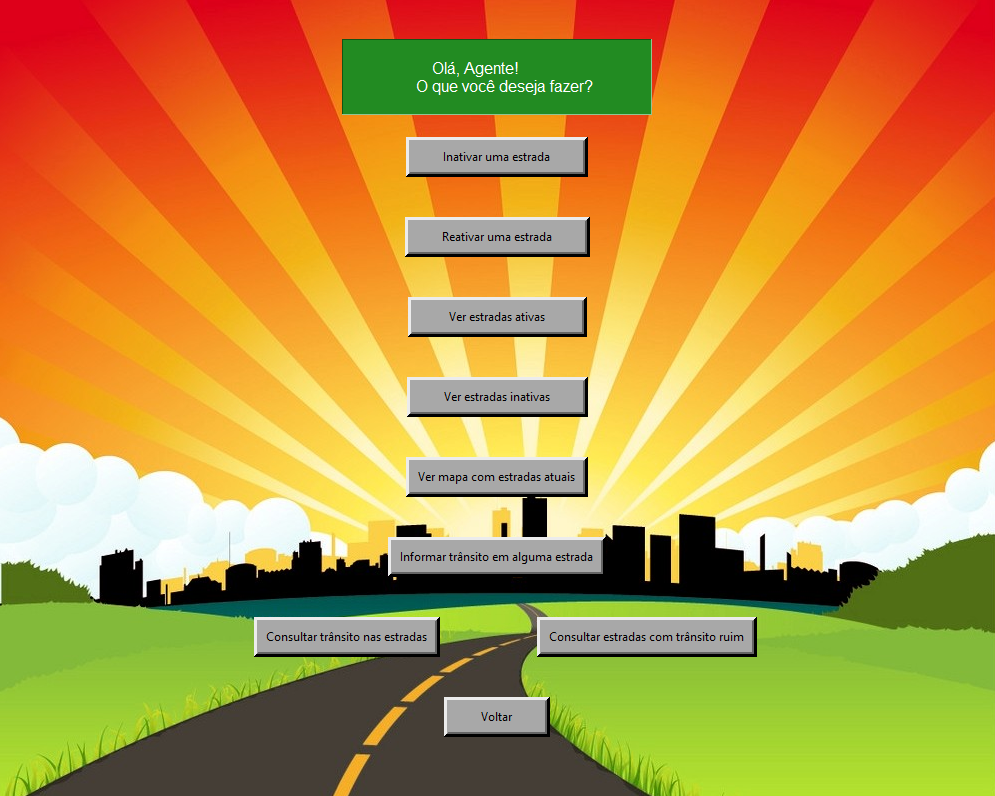
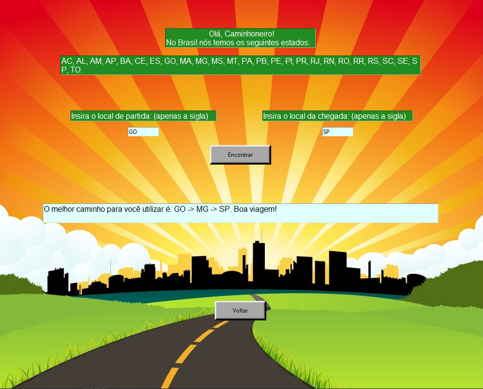
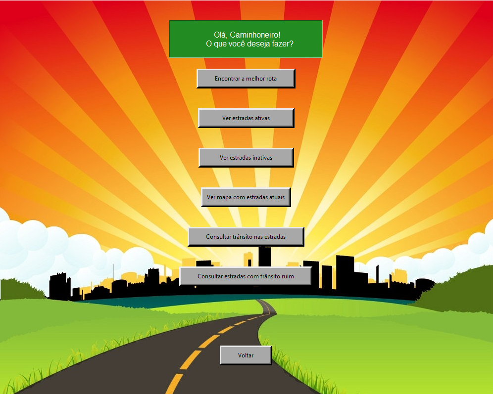
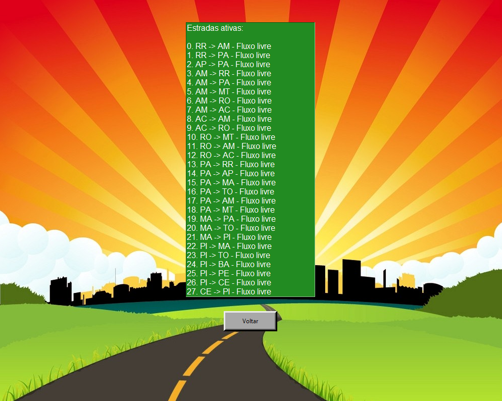
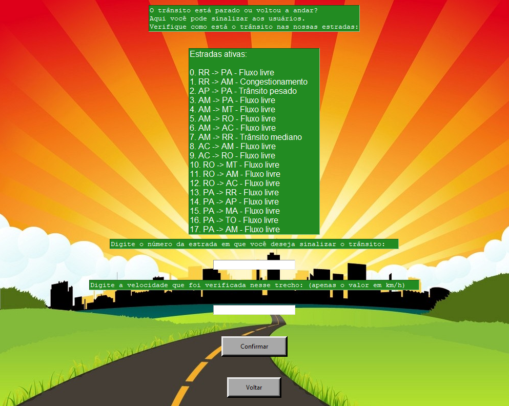
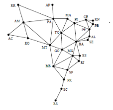

# Siga Bem Caminhoneiro 2.0

**Número da Lista**: 25<br>
**Conteúdo da Disciplina**: Grafos 2<br>

## Alunos
|Matrícula | Aluno |
| -- | -- |
| 18/0101617  |  Guilherme de Morais Richter |
| 18/0102613  |  Ítalo Fernandes Sales de Serra |

## Apresentação

Clique no link para assistir à apresentação: https://youtu.be/nEElgewGdWU

## Sobre 
A ideia por trás deste projeto é aprimorar o projeto Siga Bem Caminhoneiro 1.0, criando novas funções de gerenciamento de estradas e geração de caminhos utilizando os conhecimentos adquiridos no módulo 2 de Grafos, principalmente, a utilização de pesos nas arestas.

Temos nesta versão 2.0 as novas funções:

- Gerenciamento de trânsito nas estradas;
- Geração de melhor trajeto nas estradas por Djikstra;
- Atualização do mapa de estradas, incorporando o nível de trânsito nas estradas;
- Interface gráfica remodelada.

A ideia por trás deste projeto é auxiliar caminhoneiros a terem conhecimento sobre qual é o melhor caminhos entre os estados do Brasil por meio das estradas interestaduais. O programa possui dois perfis:
- <b>Caminhoneiro</b>: Perfil em que o caminhoneiro pode solicitar a melhor rota que deseja, ver quais estradas estão em funcionamento, quais possuem trânsito e ver um mapa das estradas em funcionamento.
- <b>Fiscal do DER</b>: Perfil em que um fiscal do DER pode entrar no aplicativo para gerenciar as estradas. Suponha que haja um acidente ou desmoronamento de uma estrada. O fiscal pode entrar no programa e desativar essa estrada, o que faz com que os caminhoneiros que procurem uma rota sejam automaticamente desviados da estrada sinalizada pelo fiscal do DER. Além disso, o fiscal do DER pode ver quais estradas estão em funcionamento ou não e ver um mapa das estradas em funcionamento. Na nova versão, o fiscal também pode informar se há trânsito nas estradas, por meio da velocidade aferida em cada uma delas.

## Screenshots

<b>Screenshot do menu inicial.</b>


<b>Screenshot do menu do fiscal do DER.</b>


<b>Screenshot de geração de melhor caminho.</b>


<b>Screenshot do menu do caminhoneiro.</b>


<b>Screenshot do trânsito no momento.</b>


<b>Screenshot do gerenciamento de trânsito.</b>


<b>Screenshot do mapa de trânsito.</b>


No mapa:
- Cor verde -> Fluxo livre
- Cor amarela -> Trânsito mediano
- Cor laranja -> Trânsito pesado
- Cor vermelha -> Congestionamento


## Instalação 
**Linguagem**: Python<br>
**Framework**: Tkinter (biblioteca), NetworkX (biblioteca)<br>


Para criar um ambiente em que seja possível rodar o programa, é necessário:

- Instalar a versão <b>3.9.5</b> do Python.

- Instalar via terminal as seguintes bibliotecas

```python
pip install tk
```
```python
pip install networkx
```
```python
pip install matplotlib
```

- Clonar o nosso repositório do GitHub para a sua máquina, digitando no terminal (necessário ter o Git instalado):

```python
git clone https://github.com/projeto-de-algoritmos/Grafos2_SigaBemCaminhoneiro.git
```

## Uso 

Para utilizar o nosso programa, é necessário que navegue no terminal até o diretório em que está clonado o nosso repositório, no caso, <b>Grafos2_SigaBemCaminhoneiro</b>.

Com o repositório aberto, rodar o seguinte comando:

```python
python interface.py
```

## Outros 

Não há outras observações.
